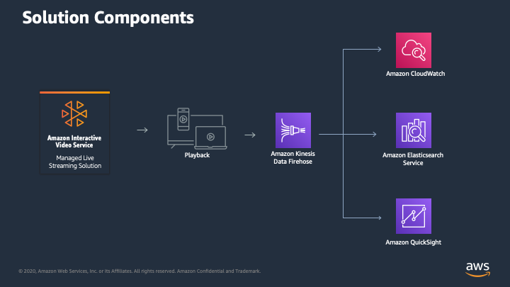
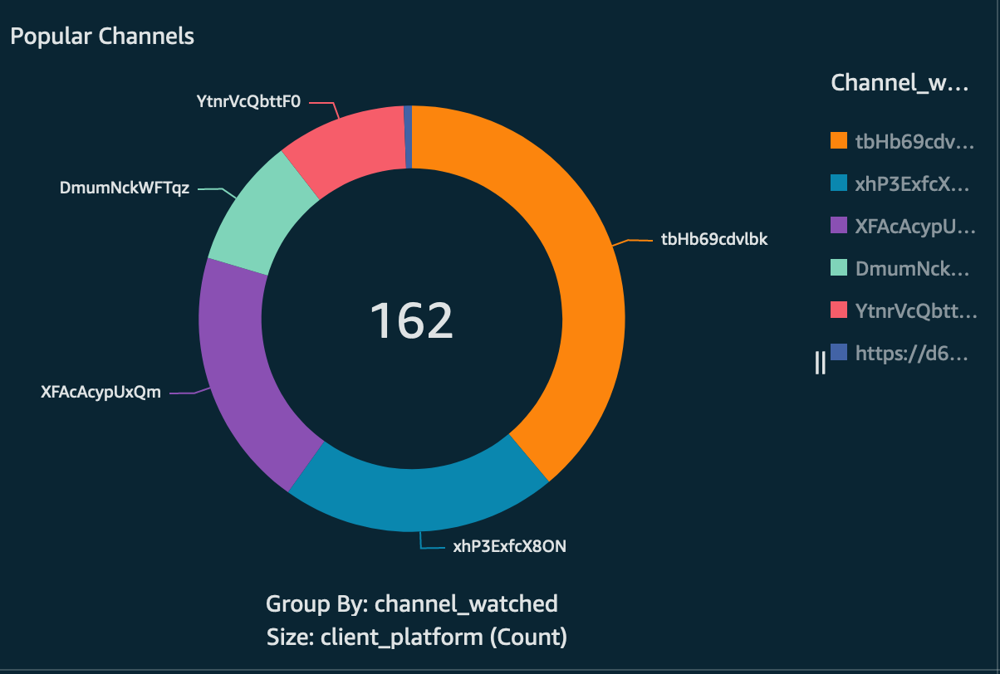
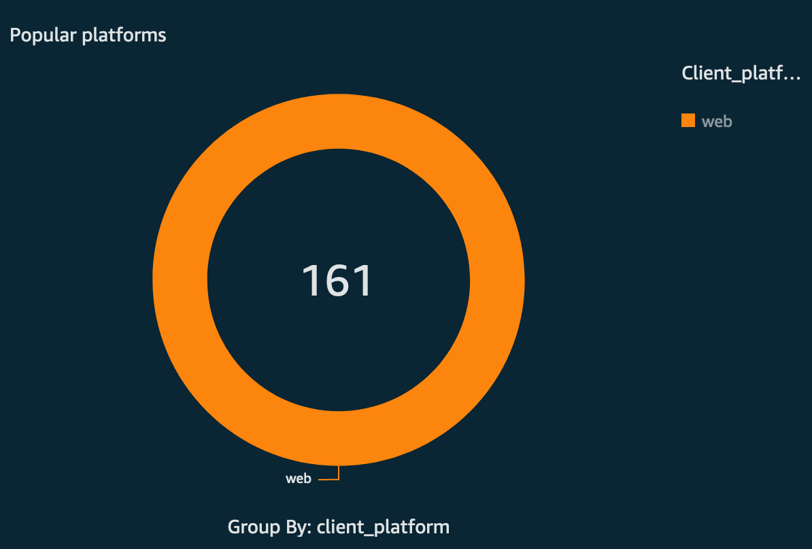
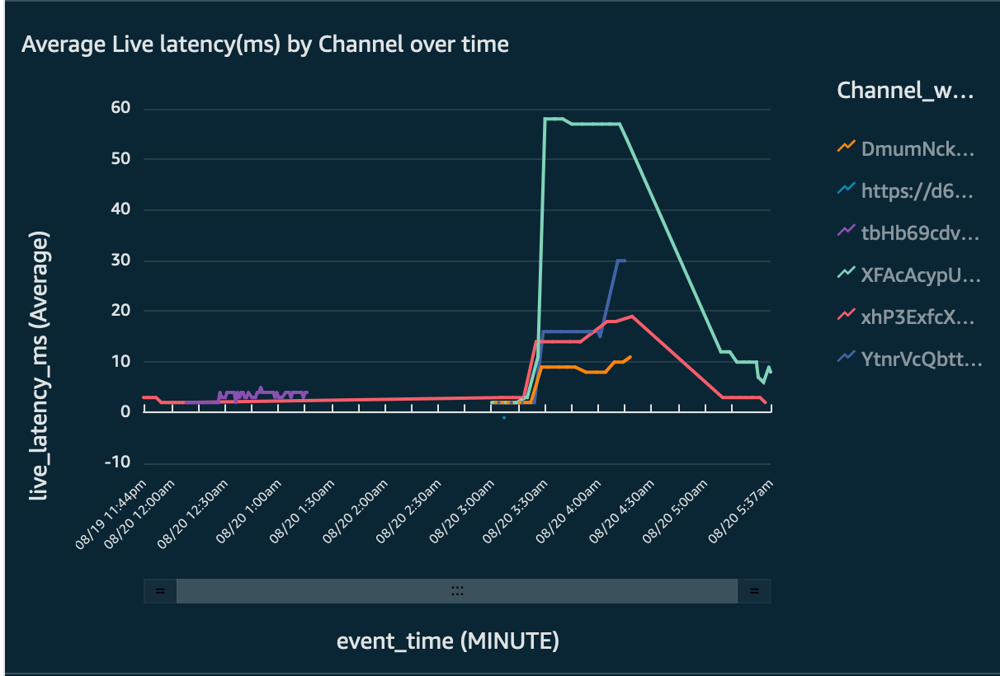

## Amazon IVS Quality of Service Dashboard Sample

This is a sample application for use measuring the performance and audience experience for streaming video delivered via Amazon Interactive Video Service.

This application consists of an integration with the IVS player SDK to capture metrics from stream viewers. The metrics captured are used to report on viewer experience over time.

Captured metrics are delivered to AWS via API Gateway and Kinesis Firehose. Kinesis Firehose delivers the metrics to three destinations which can be used for exploration and to visualize the viewer experience

* A Data Lake built on Amazon S3 and integrated with AWS Glue and Athena. Data stored in this location can be visualized using Amazon QuickSight.
* Real time sliding window analysis is performed by Amazon Kinesis Analytics. Metrics calculated by this application are delivered to CloudWatch as metrics which can be used for operational dashboards and monitoring.
* Optionally, metrics can also be delivered to an AWS ElasticSearch cluster for both near-real time and long-tail analysis using Kibana.

## Deployment

1. The demo deployment included with the solution is configured to use a publicly available IVS test stream. If you wish to use your own stream in the demo, review the IVS Getting Started guide and create a channel: https://docs.aws.amazon.com/ivs/latest/userguide/GSIVS.html
2. Once the channel is created, note the Playback URL. You can retrieve this via the AWS CLI with the command:

aws ivs get-channel --arn [channel ARN]

3. Deploy the cloudformation template either from one of the links below, or from folder: cloudformation/deployment.yaml if you build the solution in your local dev environment (see below for build instructions)
4. When prompted for the PlaybackURL Parameter at step 2 of the CloudFormation Stack Deployment, enter the IVS Stream Playback URL you identified in Step 2 for your streaming channel, or leave this at the default value.
5. Once the CloudFormation template is deployed, navigate to the Output tab in CloudFormation as several settings are emitted here. You can open the demo app by clicking on the PlayerURL link.

## Post Deployment

### Enabling CloudWatch Dashboards

1. To enable a CloudWatch dashboard, a pre-deployed Kinesis Analytics application needs to be turned on. To do so, navigate to the Amazon Kinesis Management Console.
6. From the menu on the left, select Analytics Applications.
7. Locate the Kinesis Analytics application deployed by the stack (it will be prefixed with the Stack Name). Select this and click on "Run"
8. From the CloudFormation Output tab for the deployed stack, open the URL listed for the PlayerCWDashboard. This will take you to the CloudWatch Dashboard
9. Start streaming to your IVS stream and open the demo app. The URL for the demo app is output as PlayerURL by the CloudFormation stack.
10. Metrics will be captured and will be visible under CloudWatch within a few minutes

### Enabling ElasticSearch

1. To configure delivery of metrics to ElasticSearch, please see the [ElasticSearch Guide](./docs/elasticsearch.md)

## Launching solution with Pre-built AWS CloudFormation Template

The solution is deployed using an AWS CloudFormation template with AWS Lambda backed custom resources. To deploy the solution, use one of the following CloudFormation templates and follows the instructions.

| AWS Region | AWS CloudFormation Template URL |
|:-----------|:----------------------------|
| EU (Ireland) |<a href="https://console.aws.amazon.com/cloudformation/home?region=eu-west-1#/stacks/new?stackName=ivsqos&templateURL=https%3A%2F%2Fivsqos-github-templates-eu-west-1.s3-eu-west-1.amazonaws.com%2Fqos%2Fv0.3%2Fcloudformation%2Fdeployment.yaml" target="_blank">Launch stack</a> |
| US (N.Virginia) |<a href="https://console.aws.amazon.com/cloudformation/home?region=us-east-1#/stacks/new?stackName=ivsqos&templateURL=https%3A%2F%2Fivsqos-github-templates-us-east-1.s3.amazonaws.com%2Fqos%2Fv0.3%2Fcloudformation%2Fdeployment.yaml" target="_blank">Launch stack</a> |
| US (Oregon) |<a href="https://console.aws.amazon.com/cloudformation/home?region=us-west-2#/stacks/new?stackName=ivsqos&templateURL=https%3A%2F%2Fivsqos-github-templates-us-west-2.s3-us-west-2.amazonaws.com%2Fqos%2Fv0.3%2Fcloudformation%2Fdeployment.yaml" target="_blank">Launch stack</a> |

## High level solution components

## Backend Architecture

## Build Pre-requisites

Building this project requires the following dependencies to be installed on your build/development system:

- make
- Docker
- AWS CLI (https://aws.amazon.com/cli/)

## Build Instructions

1. Copy the Makefile.sample and edit the variables in the top section to define the appropriate resources in the AWS account you wish to deploy this to
2. Save the file with the name: Makefile
3. To create the S3 bucket to store the build artifacts, run the command:
make creates3
4. To build the artifacts and Cloudformation template to deploy the solution, run the command:
make all

## Sample QuickSight Dashboard

## Security

See [CONTRIBUTING](CONTRIBUTING.md#security-issue-notifications) for more information.

## License

This library is licensed under the MIT-0 License. See the LICENSE file.
