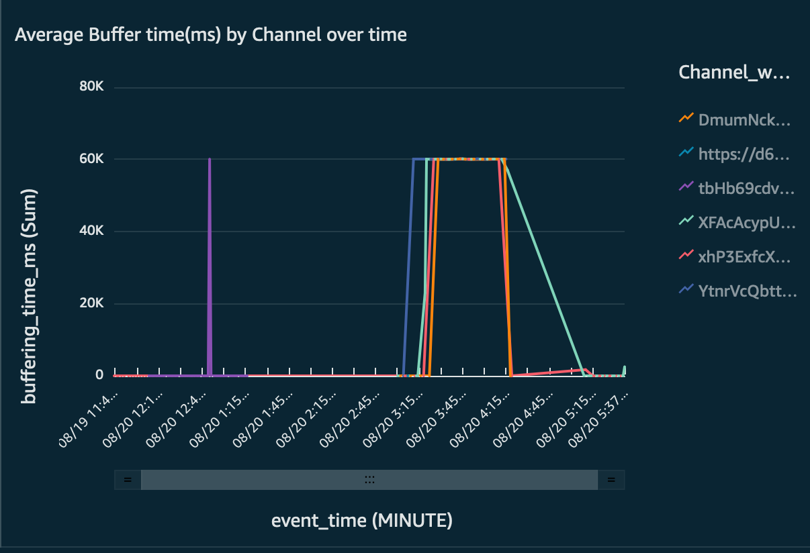
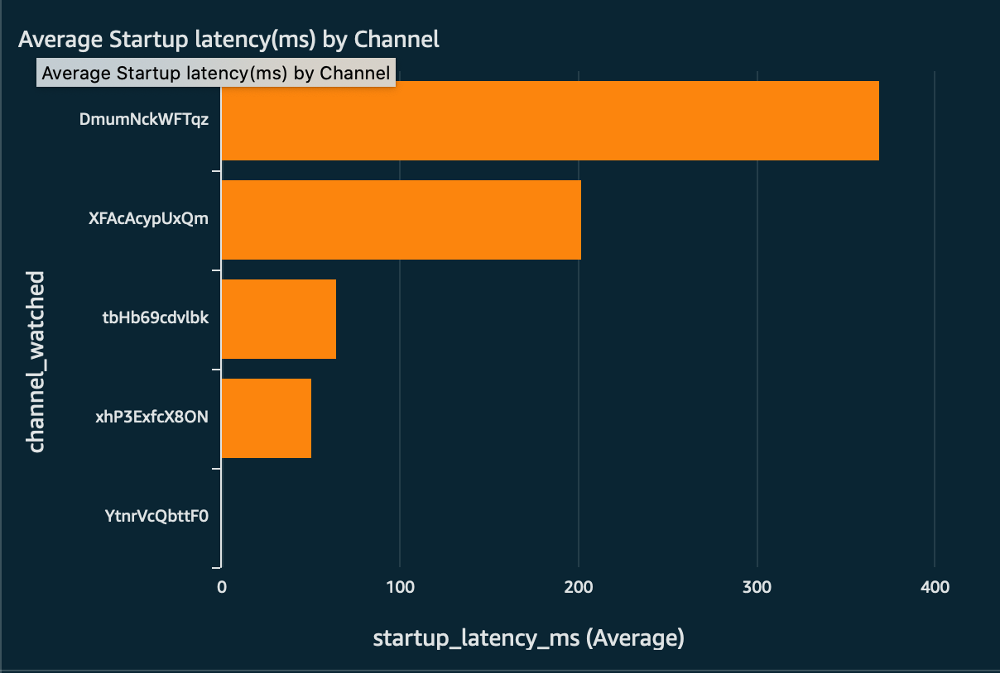

## Amazon IVS Quality of Service Dashboard Sample

This is a sample application for use measuring the performance and audience experience for streaming video delivered via Amazon Interactive Video Service.

This application deploys an integration with the IVS player SDK to capture metrics from stream viewers capturing their experience over time.

Captured metrics are processed and presented as both CloudWatch metrics and archived in a Data Lake where they can be reported on via QuickSight or ElasticSearch.

## High level solution components

## Backend Architecture

## Build Pre-requisites

Building this project requires the following dependencies to be installed on your build/development system:

- make
- Docker
- AWS CLI (https://aws.amazon.com/cli/)

## Build Instructions

1. Copy the Makefile.sample and edit the variables in the top section to define the appropriate resources in the AWS account you wish to deploy this to
2. Save the file with the name: Makefile
3. To create the S3 bucket to store the build artifacts, run the command:
make creates3
4. To build the artifacts and Cloudformation template to deploy the solution, run the command:
make all

## Deployment

1. Prior to deploying the demo application, review the IVS Getting Started guide and create a channel: https://docs.aws.amazon.com/ivs/latest/userguide/GSIVS.html
2. Once the channel is created, note the Playback URL. You can retrieve this via the AWS CLI with the command:

aws ivs get-channel --arn [channel ARN]

3. Deploy the cloudformation template either from the S3 bucket the template is uploaded to during the build process, or from folder: cloudformation/deployment.yaml
4. When prompted for the LIVEURL Parameter at step 2, enter the IVS Stream Playback URL you identified in Step 2 for your streaming channel.
5. Once the CloudFormation template is deployed, navigate to the Amazon Kinesis Management Console.
6. From the menu on the left, select Analytics Applications.
7. Locate the Kinesis Analytics application deployed by the stack (it will be prefixed with the Stack Name). Select this and from the Actions drop down menu, click on "Start Application"
8. From the CloudFormation Output menu, open the URL listed
9. Start streaming to your IVS stream
10. Metrics will be captured and will be visible under CloudWatch

## Working with the sample application

Link to extended docs here

## Sample QuickSight Dashboard

## Security

See [CONTRIBUTING](CONTRIBUTING.md#security-issue-notifications) for more information.

## License

This library is licensed under the MIT-0 License. See the LICENSE file.
