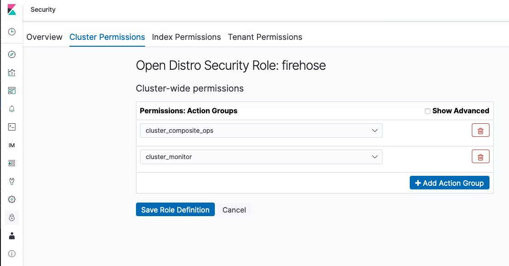
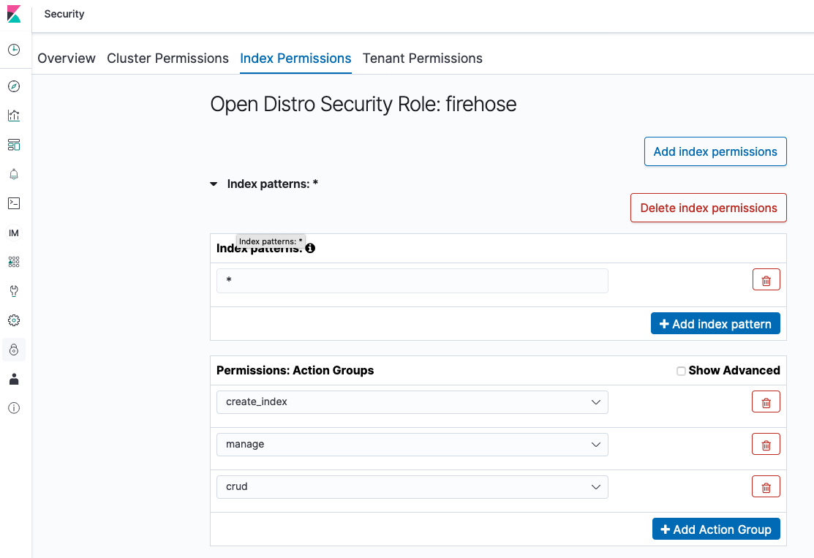
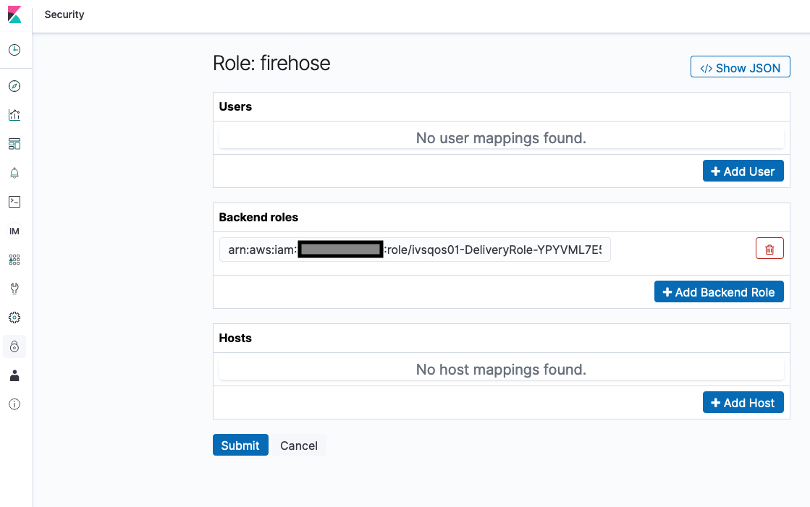

## Configuring ElasticSearch

### Deploying AWS ElasticSearch

Currently, this solution only supports delivery to AWS ElasticSearch clusters with a public-endpoint and fine-grained access control enabled. To deploy an ElasticSearch cluster to receive metrics from the solution, follow these steps:

1. Navigate to the AWS ElasticSearch Management Console in a supported region (us-east-1, us-west-2, eu-west-1)
1. Create a new Domain
1. Determine if you which to deploy as Production or Development and testing, as per your requirements.
1. Complete the basic infrastructure configuration settings for the domain. Note that fine-grained access control is not supported on the t2.* family of instance-types. We recommend by default selecting an r5.large.elasticsearch or m5.large.elasticsearch as your node type. 
1. Configure Public access for the domain and enable fine-grained access control
1. Select 'Create master user' and create a master username and password with a secure password
1. Configure the Access Policy to "Allow open access to the domain". Note, access to the domain under this configuration is controlled via the Fine-grained access control module within ElasticSearch.

### Allowing Kinesis Firehose to POST to ElasticSearch via Fine-Grained Access Control

In order to configure ElasticSearch to accept logs from the Kinesis Firehose stream, you will need to add a role to your cluster:

1. Navigate to the AWS ElasticSearch Management Console and select your cluster
1. Click the link to Kibana under the Cluster Overview tab
1. Once logged in to Kibana, navigate to Security->Roles via the menu on the left
1. Create a new Role named 'firehose'
1. Grant the following permissions:

``{
  "cluster_permissions": [
    "cluster_composite_ops",
    "cluster_monitor"
  ],
  "index_permissions": [{
    "index_patterns": [
      "*"
    ],
    "allowed_actions": [
      "create_index",
      "manage",
      "crud"
    ]
  }]
}``
1. Note, you can set the value under index_patterns to the prefix of the index you have set when deploying the CloudFormation template for the solution. 

1. Save the changes

Next map the Kinesis Firehose IAM Role to this new ElasticSearch policy:

1. Navigate to Security->Role Mapping
1. Click the '+' to add a new Role Mapping
1. Select the 'firehose' role from the dropdown menu
1. Under Backend Roles, add the ARN of the Role assigned to Kinesis Firehose which is listed in the CloudFormation Stack output under the value "DeliveryRoleArn" once the template deploys successfully

1. Save the changes

Now Kinesis Firehose can post to your ES cluster. 