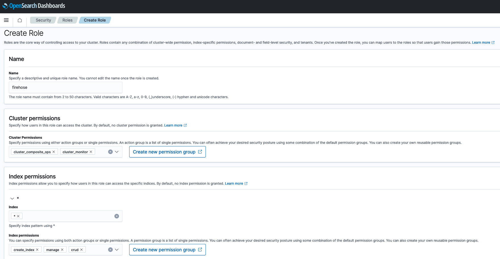
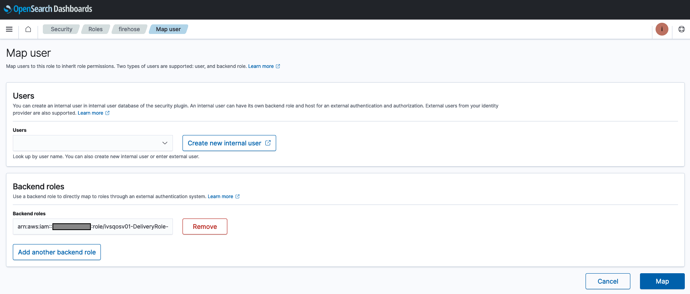
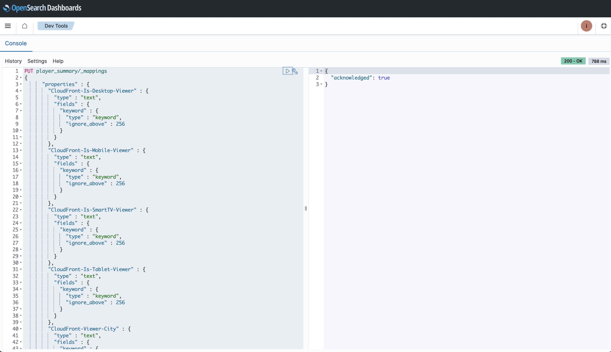
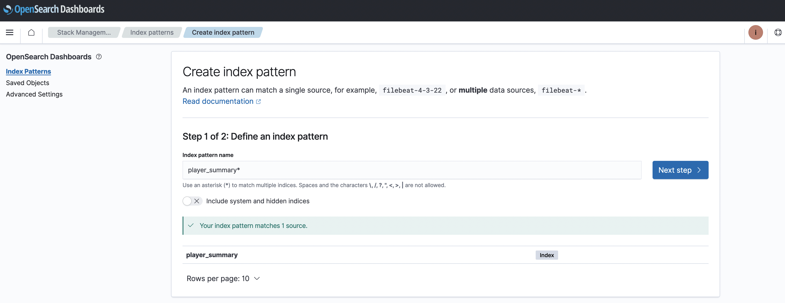

## Configuring OpenSearch

### Deploying Amazon OpenSearch

Currently, this solution only supports delivery to Amazon OpenSearch clusters with a public-endpoint and fine-grained access control enabled. To deploy an OpenSearch cluster to receive metrics from the solution, follow these steps:

1. Navigate to the Amazon OpenSearch Management Console in a supported region (e.g., `us-east-1`, `us-west-2`, `eu-west-1`)
1. Create a new Domain
1. Determine which to deploy as `Production` or `Development and testing`, as per your requirements.
1. Choose the Version you want to use (e.g., `OpenSearch 2.5(latest)`)
1. Complete the basic infrastructure configuration settings for the domain. Note that fine-grained access control is not supported on the `t2.*` family of instance-types. We recommend by default selecting an `r5.large.search` or `m5.large.search` as your node type.
1. Configure Public access for the domain and enable fine-grained access control
1. Select `Create master user` and create a master username and password with a secure password
1. Configure the Access Policy to "`Only use fine-grained access control` (i.e `Allow open access to the domain`)". Note, access to the domain under this configuration is controlled via the Fine-grained access control module within OpenSearch.

### Allowing Kinesis Firehose to POST to OpenSearch via Fine-Grained Access Control

In order to configure OpenSearch to accept logs from the Kinesis Firehose stream, you will need to add a role to your cluster:

1. Navigate to the Amazon OpenSearch Management Console and select your cluster
1. Click the link to the OpenSearch Dashboard under the `General information`
1. Once logged in to the OpenSearch Dashboard, navigate to `Security` > `Roles` via the menu on the left
1. Create a new Role named '`firehose`'
1. Grant the following permissions:

``{
  "cluster_permissions": [
    "cluster_composite_ops",
    "cluster_monitor"
  ],
  "index_permissions": [{
    "index_patterns": [
      "*"
    ],
    "allowed_actions": [
      "create_index",
      "manage",
      "crud"
    ]
  }]
}``
1. Note, you can set the value under index_patterns to the prefix of the index you have set when deploying the CloudFormation template for the solution.

Save the changes

### Next map the Kinesis Firehose IAM Role to this new OpenSearch policy:

1. In the OpenSearch Dashboard, navigate to `Security` > `Role` Mapping
1. Select the '`firehose`' role and then go to the ‘`Mapped user`’ tab
1. Click the `Manage mapping` to add a new Role Mapping
1. Under Backend roles, add the ARN of the Role assigned to Kinesis Firehose which is listed in the CloudFormation Stack Outputs under the value "`DeliveryRoleArn`" once the template deploys successfully

Save the changes. Now Kinesis Firehose can post to your OpenSearch cluster.

### Next define the OpenSearch index and define the schema:

1. In the OpenSearch Dashboard, navigate to `Dev Tools`
1. Create the index by using the `PUT` command followed by the index name. The OpenSearch index name is what you provided while deploying the CloudFormation template in the parameter 'ElasticSearchIndexName'

1. Next create the index schema by using command `PUT INDEX_NAME/_mappings` along with the schema definition available under '`templates/elasticsearch_mappings.json`'

### Next define the OpenSearch index pattern:
1. In the OpenSearch Dashboard, navigate to the `Stack Management`
1. Click '`Index Patterns`' and select '`Create index patterns`'

1. Enter the index name and you should see it listed in below search result and click '`Next step`'

1. Select `event_time` as the Time filter field name and click '`Create index pattern`'

You should be able to see all the fields in the index and its data types and other search index attributes. At this stage we are ready to start building the dashboards on OpenSearch.

### Creating the dashboards on OpenSearch:
1. In the OpenSearch Dashboard, navigate to the `Stack Management`
1. Click on '`Saved Objects`' and click the `Import` link on the right hand side.
1. Select '`export.ndjson`' file which is under folder `templates` and import the dashboard.
1. Navigate to Dashboard and select the newly created dashboard (e.g., `IVSQoS5`).
1. You should see a set of visualizations auto created and its time now to push some events to see the dashboard in action
