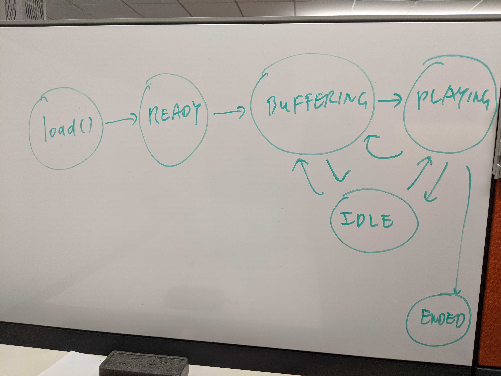
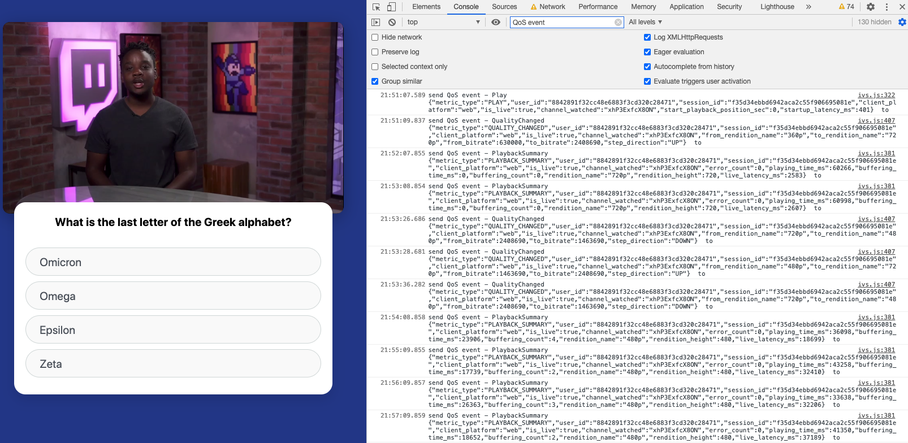
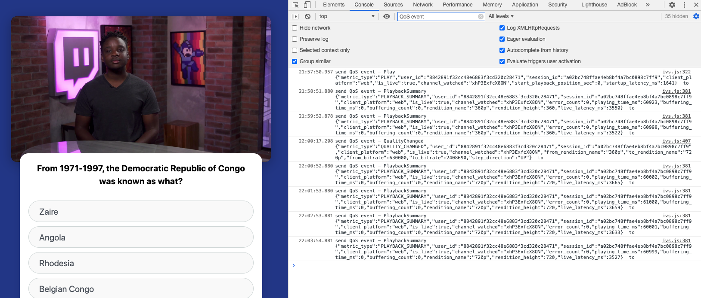

# Sample Web Player of Amazon IVS Quality-Of-Service and Timed-Metadata-Feedback Dashboard

## 1. What Does the Sample Web Player Do

This sample web player is written based on IVS player SDK 1.0.0, and can

- Play an IVS live stream (or an IVS VOD asset);

- Based on the player SDK's events, assemble playback QoS events (of the following types) and send them to an IVS QoS dashboard backend;

  - PLAY: at the beginning of a playback session;

  - STOP: at the end of a playback session;

  - PLAYBACK_SUMMARY: periodically (e.g., every minute) during a playback session;

  - QUALITY_CHANGE: whenever rendition change takes place.

- Render multiple-choice questions based on the timed metadata embedded in an IVS live (or VOD) video, assemble question/answer events (of the following type) and send them to an IVS timed-metadata-feedback dashboard backend;

  - QUIZ_ANSWER: whenever a multiple-choice question is answered.

## 2. Play With the Sample Web Player Yourself

### 2.1 Host Nginx on Your Local Computer

**Step 1:** On Mac, you can install Nginx with Homebrew by running:

- ```$ brew update```;

- ```$ brew install nginx```.

**Step 2:** Point the root directory to the folder of this sample web player, e.g., */Users/yuesshen/aws-samples/amazon-ivs-qos-dashboard-timed-metadata-sample/web/IVSplayer*

- Modify */usr/local/etc/nginx/nginx.conf* as

```
http {
    ...
    server {
        listen       8080;
        server_name  localhost;

        location / {
            root /Users/yuesshen/aws-samples/amazon-ivs-qos-dashboard-timed-metadata-sample/web/IVSplayer;
            index  index.html index.htm;
        }
    ...
```

**Step 3:** Run Nginx in background

- To start Nginx, run ```sudo brew services start nginx```;

- After you are done with your experiment, run ```sudo brew services stop nginx``` to stop Nginx.

### 2.2 Run the Sample Web Player and See the Assembled Timed-Metadata-Feedback & QoS Events

In Chrome, type *http://localhost:8080/* in the web address bar, the sample web player will play a test channel with multiple-choice questions (see below). If your selected answer is correct, the answer window will turn green, otherwise it will be red.


When a viewer answers a multiple-choice question, a timed-metadata-feedback event will be assembled and sent to the backend. To see the console output for these events,

- Open the Chrome Developer Tool (in Chrome, select "View", "Developer", "Developer Tool");

- Select "Console";

- Type *"QoS event"* in "Filter";

- See the QoS events of PLAY, QUALITY_CHANGED, PLAYBACK_SUMMARY (see below).


- Type *"timed metadata feedback"* in "Filter";

- See the timed-metadata-feedback events including the question and the selected answer (see below).


### 2.3 Customize Your IVS Video Channel and Dashboard Backend

Although the CloudFormation template in this repo provides the default values of a test channel's playback URL and a test backend's Gateway API, you can still customize them in *.js/config.js*,:

- ```"PlaybackURL":``` an IVS live channel (or VOD title)'s playback URL;

- ```"SendQoSEventURL":``` end point for sending playback QoS (i.e., playback summary) events;

- ```"SendQuizAnswerURL":``` end point for sending timed metadata feedback (e.g., quiz answer) events.

## 3. Deep Dive Into the Design and the Source Code

### 3.1 Playback QoS Events

#### 3.1.1 Submission Frequency and Metrics Covered
The QoS events are designed as:

- Each player QoS event (PLAY, STOP, PLAYBACK_SUMMARY, QUALITY_CHANGED) is about one viewer watching one particular channel (i.e., one playback session);

- There is only one PLAY event and one STOP event for one playback session;

- There can be multiple PLAYBACK_SUMMARY events for a playback session, which covers a pre-configurated period (e.g., one minute) as a tradeoff between latency and cost;

- If the player state is either “IDLE” or “ENDED” throughout the entire minute, no PLAYBACK_SUMMARY event will be sent for this minute;

- There can be multiple QUALITY_CHANGED events for a playback session.

The data collected within the QoS events can be leveraged to generate two types of metrics:

- User activities:

  - Concurrent viewers;

  - Client platform type;

  - Distribution of playback start time (per channel) - could be useful for content platform to improve the viewership of a channel;

  - Distribution of playback end time (per channel) - could be useful for content platform to improve the viewership of a channel;

  - Duration watched (per channel).

- QoS:

  - Rendition watched;

  - Startup latency (delay from loading the playback URL to the first video frame rendered);

  - Live latency (delay from ingest to playback, i.e., end-to-end latency excluding the broadcast tool's latency);

  - Playback buffering % (ratio between buffer time and (playing time + buffering time));

  - Playback buffering count;

  - Playback errors;

  - Viewer's location (based on his/her IP).

#### 3.1.2 JSON Schema

##### 3.1.2.1 PLAY

| Field Name | Data Type | Note |
| ---------- | --------- | ---- |
|  |  | **// event type (QoS, timed metadata feedback, etc.)** |  
| metric_type | string | "PLAY" for playback start event |
|  |  | **// user/session ID** |  
| user_id | string | UUID of the device |
| session_id | string | UUID of the playback session |
|  |  | **// client platform and content** |  
| client_platform | string | e.g., “web”, “android”, “ios” |
| is_live | boolean |  |
| channel_watched | string | the string after ".channel." in the playback URL, e.g., “xhP3ExfcX8ON” for the test channel |
|  |  | **// startup latency** |
| startup_latency_ms | integer | latency  in ms from load() being called to state becoming PLAYING for the first time in a playback session |

##### 3.1.2.2 STOP

| Field Name | Data Type | Note |
| ---------- | --------- | ---- |
|  |  | **// event type (QoS, timed metadata feedback, etc.)** |  
| metric_type | string | "STOP" for playback start event |
|  |  | **// user/session ID** |  
| user_id | string | UUID of the device |
| session_id | string | UUID of the playback session |
|  |  | **// client platform and content** |  
| client_platform | string | e.g., “web”, “android”, “ios” |
| is_live | boolean |  |
| channel_watched | string | the string after ".channel." in the playback URL, e.g., “xhP3ExfcX8ON” for the test channel |

##### 3.1.2.3 PLAYBACK_SUMMARY

| Field Name | Data Type | Note |
| ---------- | --------- | ---- |
|  |  | **// event type (QoS, timed metadata feedback, etc.)** |  
| metric_type | string | "PLAYBACK_SUMMARY" for QoS event |
|  |  | **// user/session ID** |  
| user_id | string | UUID of the device |
| session_id | string | UUID of the playback session |
|  |  | **// client platform and content** |  
| client_platform | string | e.g., “web”, “android”, “ios” |
| is_live | boolean |  |
| channel_watched | string | the string after ".channel." in the playback URL, e.g., “xhP3ExfcX8ON” for the test channel |
|  |  | **// playback summary** |  
| error_count | integer |  |
| playing_time_ms | integer | the duration (in ms) of the player SDK staying in the "PLAYING" state |
| buffering_time_ms | integer | the duration (in ms) of the player SDK staying in the "BUFFERING" state |
| buffering_count | integer | how many times does the player SDK enter the "BUFFERING" state in the last minute (or whatever sampling period)|
| rendition_name | string | e.g., "Source", "720p60", "720p", "480p", "240p", "160p" (snapshot taken right before the event is sent) |
| rendition_height | integer | (snapshot taken right before the event is sent) |
| live_latency_ms | integer | latency in ms based on "getLiveLatency()" covering the latency from ingest to playback (i.e., not include the latency of broadcast tool), live only. set to -1, if VOD |

##### 3.1.2.4 QUALITY_CHANGED

| Field Name | Data Type | Note |
| ---------- | --------- | ---- |
|  |  | **// event type (QoS, timed metadata feedback, etc.)** |  
| metric_type | string | "QUALITY_CHANGED" for playback start event |
|  |  | **// user/session ID** |  
| user_id | string | UUID of the device |
| session_id | string | UUID of the playback session |
|  |  | **// client platform and content** |  
| client_platform | string | e.g., “web”, “android”, “ios” |
| is_live | boolean |  |
|  |  | **// rendition change** |  
| from_rendition_group | string |  |
| to_rendition_group | string |  |
| from_rendition_bitrate | integer |  |
| to_rendition_bitrate | integer |  |
| step_direction | string | "UP" or "DOWN" |

#### 3.1.3 Implementation

Search for *"QoS event"* in *ivs.js* and see the implementation of the following logic:

- Definition of the work variables, right after the creation of ```IVSPlayer``` (from line 39);

- Send off PLAY, STOP, and update the work variables when player state changes (from line 62, 90, 103, etc.);

- Send off a PLAYBACK_SUMMARY event and reset some work varibles every minute (from line 198);

- Subroutine of assembing an QoS event and sending it to the QoS dashboard backend (from line 265);

- Update work variables (whose values are used in assembing QoS events), when receiving a player-state-change (see below) or playback-error event from the IVS player SDK (from line 57).



#### 3.1.4 Test Plan

To execute the test plan, you might need to use the Chrome Developer Tool's "Network", "Throttling" (see below).


Test plan:

- #1 Good network condition - Play the test channel under a reliable network condition having >10mbps bandwidth;

- #2 Changing network contiion - Start from unthrottled, then throttle to 1mbps after seeing the 2nd QoS event;

- #3 Changing network contiion - Start from throttled 1mbps, then unthrottle the bandwidth after seeing the 2nd QoS event.

Reference test result #1:

| Test Case | Which QoS Event | Expected *startupLatencyMs* | *playingTimeMs* | *bufferingTimeMs* | *renditionHeight* | *LiveLatencyMs* | *errorCount* |
| --------- | --------------- | --------------------------- | --------------- | ----------------- | --------------- | --------------- | ------------ |
| #1 | 1st       | ~2s | ~58s | ~0s | 720 | ~3s | ~0 |
|    | Following | 0s  | ~60s | ~0s | 720 | ~3s | ~0 |

Reference screenshots of the console output #1:


Reference test result #2:

| Test Case | Which QoS Event | Expected *startupLatencyMs* | *playingTimeMs* | *bufferingTimeMs* | *renditionHeight* | *LiveLatencyMs* | *errorCount* |
| --------- | --------------- | --------------------------- | --------------- | ----------------- | --------------- | --------------- | ------------ |
| #2 | 1st       | ~2s | ~58s | ~0s | 720 | ~3s | ~0 |
|    | 2nd       | 0s  | ~60s | ~0s | 720 | ~3s | ~0 |
|    | 3rd       | 0s  | >55s | <5s | 360 | <6s | ~0 |
|    | 4th       | 0s  | ~60s | ~0s | 360 | <6s | ~0 |

Reference screenshots of the console output #2:



Reference test result #3:

| Test Case | Which QoS Event | Expected *startupLatencyMs* | *playingTimeMs* | *bufferingTimeMs* | *renditionHeight* | *LiveLatencyMs* | *errorCount* |
| --------- | --------------- | --------------------------- | --------------- | ----------------- | --------------- | --------------- | ------------ |
| #3 | 1st       | ~5s | ~55s | ~0s | 360 | <5s | ~0 |
|    | 2nd       | 0s  | ~60s | ~0s | 360 | <5s | ~0 |
|    | 3rd       | 0s  | ~60s | ~0s | 720 | <5s | ~0 |
|    | 4th       | 0s  | ~60s | ~0s | 720 | <5s | ~0 |

Reference screenshots of the console output #3:



### 3.2 Timed-Metadata-Feedback Events

#### 3.2.1 Submission Triggering and Content Included

When a viewer receives a multiple-choice question and select an answer, an timed-metadata-feedback event will be sent to the backend, including the question and the answer selected.

#### 3.2.2 JSON Schema

| Field Name | Data Type | Note |
| ---------- | --------- | ---- |
|  |  | **// event type (QoS, timed metadata feedback, etc.)** |
| metric_type | string | "QUIZ_ANSWER" in this example |
|  |  | **// user/session ID** |  
| user_id | string | UUID of the device |
| session_id | string | UUID of the playback session |
|  |  | **// timed metadata and viewer feedback** |
| question | string | e.g., "Which team won the 2019 World Series?" |
| answer | string | e.g., "Washington Nationals" |

#### 3.2.3 Implementation

Search for *"timed metadata feedback"* in *ivs.js* and see how ```sendQuizAnswer()``` is called and implemented.

#### 3.2.4 Test Plan

As stated in section 2.2, check the console output when a multiple-choice answer is selected.
